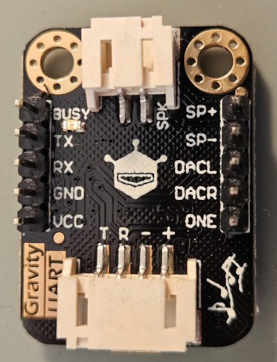
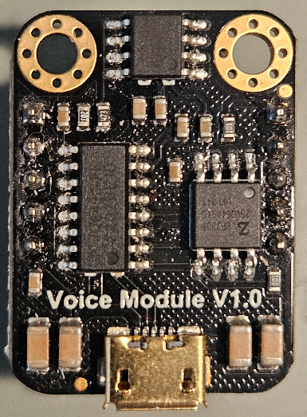

# DFR0534
An Arduino Uno/Nano, ESP32 library for a [DFR0534](https://wiki.dfrobot.com/Voice_Module_SKU__DFR0534) audio module. The library works with SoftwareSerial/ HardwareSerial and is very similar to https://github.com/sleemanj/JQ8400_Serial, but is no fork.

[PDF-Documentation](DFR0534.pdf)

Examples, how to use the library
- [playFileByName](/examples/playFileByName/playFileByName.ino)
- [playFileByNumber](/examples/playFileByNumber/playFileByNumber.ino)
- [playCombined](/examples/playCombined/playCombined.ino)

## SoftwareSerial for Arduino Uno/Nano
To create a DFR0534 object pass the SoftwareSerial object as a parameter to the DFR0534 constructor, for example

```
#include <SoftwareSerial.h>
#include <DFR0534.h>

#define TX_PIN A0
#define RX_PIN A1
SoftwareSerial g_serial(RX_PIN, TX_PIN);
DFR0534 g_audio(g_serial);
...
```

## HardwareSerial for ESP32
To create a DFR0534 object pass the HardwareSerial object as a parameter to the DFR0534 constructor, for example

```
#include <DFR0534.h>

#define TX_PIN 19
#define RX_PIN 23
HardwareSerial g_serial(1);

DFR0534 g_audio(g_serial);

void setup() {
  g_serial.begin(9600, SERIAL_8N1, RX_PIN, TX_PIN);
...
```

## License and copyright
This library is licensed under the terms of the 2-Clause BSD License [Copyright (c) 2024 codingABI](LICENSE.txt). 

## Appendix

### Supported functions


| Function  | Notes |
| ------------- | ------------- |
| decreaseVolume |   |
| fastBackwardDuration |   |
| fastForwardDuration |   |
| getDrive | Returns DFR0534::DRIVEUSB, DFR0534::DRIVESD, DFR0534::DRIVEFLASH or DFR0534::DRIVEUNKNOWN, Example [playFileByNumber](/examples/playFileByNumber/playFileByNumber.ino) |
| getDrivesStates | Returns bitmask for DFR0534::DRIVEUSB, DFR0534::DRIVESD, DFR0534::DRIVEFLASH, Example [playFileByNumber](/examples/playFileByNumber/playFileByNumber.ino) |
| getDuration |   |
| getFileName | Example [playFileByNumber](/examples/playFileByNumber/playFileByNumber.ino)  |
| getFileNumber | Example [playFileByNumber](/examples/playFileByNumber/playFileByNumber.ino)  |
| getFirstFileNumberInCurrentDirectory | Example [playFileByNumber](/examples/playFileByNumber/playFileByNumber.ino)  |
| getRuntime |   |
| getStatus | Returns DFR0534::STOPPED, DFR0534::PLAYING, DFR0534::PAUSED or DFR0534::STATUSUNKNOWN, Example [playFileByNumber](/examples/playFileByNumber/playFileByNumber.ino)|
| getTotalFiles | Example [playFileByNumber](/examples/playFileByNumber/playFileByNumber.ino)  |
| getTotalFilesInCurrentDirectory | Example [playFileByNumber](/examples/playFileByNumber/playFileByNumber.ino)  |
| increaseVolume |   |
| insertFileByNumber |   |
| pause |   |
| play |   |
| playCombined | The DFR0534 uses a special two char file name format and fixed folder /ZH for this function. Look a the a the example [playCombined](/examples/playCombined/playCombined.ino) or  comments to this function in [DFR0534.cpp](src/DFR0534.cpp) for details |
| playFileByName | The DFR0534 uses a special 8+3 file name format. Before using this function take a look a the example [playFileByName](/examples/playFileByName/playFileByName.ino) or the comments to this function in [DFR0534.cpp](src/DFR0534.cpp) for details |
| playFileByNumber | Example [playFileByNumber](/examples/playFileByNumber/playFileByNumber.ino)  |
| playLastInDirectory |   |
| playNext |   |
| playNextDirectory |   |
| playPrevious |   |
| prepareFileByNumber |   |
| repeatPart |   |
| setChannel | Seems make no sense on a DFR0534 audio module |
| setDrive | Supports DFR0534::DRIVEUSB, DFR0534::DRIVESD and DFR0534::DRIVEFLASH |
| setDirectory | Seems not to work |
| setEqualizer | Supports DFR0534::NORMAL, DFR0534::POP, DFR0534::ROCK, DFR0534::JAZZ and DFR0534::CLASSIC  |
| setLoopMode | Supports DFR0534::LOOPBACKALL, DFR0534::SINGLEAUDIOLOOP, DFR0534::SINGLEAUDIOSTOP, DFR0534::PLAYRANDOM, DFR0534::DIRECTORYLOOP, DFR0534::RANDOMINDIRECTORY, DFR0534::SEQUENTIALINDIRECTORY and DFR0534::SEQUENTIAL |
| setRepeatLoops |   |
| setVolume | Volume level (0 = mute, 30 = max), Example [playFileByNumber](/examples/playFileByNumber/playFileByNumber.ino)  |
| startSendingRuntime |   |
| stop |   |
| stopCombined |   |
| stopInsertedFile |   |
| stopRepeatPart |   |
| stopSendingRuntime |   |

For function details see comments in [DFR0534.cpp](src/DFR0534.cpp)

### DFR0534 pinout




Minimal schematic to use this library
| Pin  | Connected to |
| ------------- | ------------- |
| TX | SoftwareSerial/HardwareSerial RX  |
| RX | SoftwareSerial/HardwareSerial TX* |
| GND | Ground  |
| VCC | 3.3-5V  |
| SP+ | Speaker + connector |
| SP- | Speaker - connector |

*If your microcontroller runs at 5V use a 1k resistor between RX and SoftwareSerial TX.
